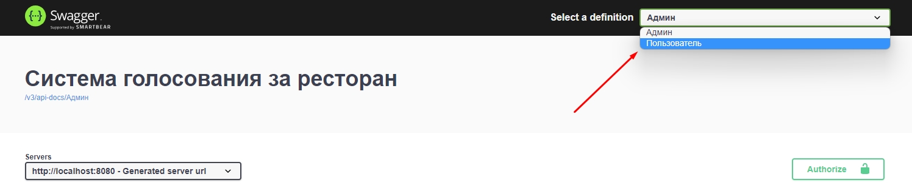
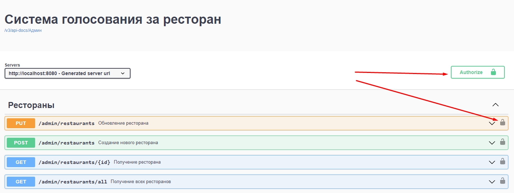

## Выпускной проект TopJava

-----------------------------
## Technical requirement
Design and implement a REST API using Hibernate/Spring/SpringMVC (Spring-Boot preferred!) **without frontend**.

The task is:

Build a voting system for deciding where to have lunch.

* 2 types of users: admin and regular users
* Admin can input a restaurant and it's lunch menu of the day (2-5 items usually, just a dish name and price)
* Menu changes each day (admins do the updates)
* Users can vote for a restaurant they want to have lunch at today
* Only one vote counted per user
* If user votes again the same day:
    - If it is before 11:00 we assume that he changed his mind.
    - If it is after 11:00 then it is too late, vote can't be changed

Each restaurant provides a new menu each day.

As a result, provide a link to github repository. It should contain the code, README.md with API documentation and couple curl commands to test it (**better - link to Swagger**).

-----------------------------

## Демо приложения

Демо приложения (последняя актуальная сборка, ссылка на Сваггер) размещено по адресу:
[http://ovz1.slava-rossii.wmekm.vps.myjino.ru:49218/swagger-ui/index.html](http://ovz1.slava-rossii.wmekm.vps.myjino.ru:49218/swagger-ui/index.html)

## Swagger

Ссылка на сваггер:
[http://localhost:8080/swagger-ui/index.html](http://localhost:8080/swagger-ui/index.html)

API разделено на 2 части - админскую и пользовательскую. Выбор API осуществляется при помощи выпадающего меню справа сверху:

Поскольку в проекте реализована авторизация, для осуществления запросов необходимо использовать токен.

Получить токен можно запросом авторизации (`POST /login`) или через `test/http/login.http`.

Примеры пользователей из миграций: `admin` / `admin`, `chiller2` / `123`.

Токен можно вставить для всех запросов сразу и для каждого запроса в отдельности:

-----------------------------

## Технологический стек

* Java 25
* Spring Boot 3.5.12
* Spring Security
* Hibernate
* Flyway
* springdoc-openapi (Swagger UI)
* H2
* Gradle 9.6.1